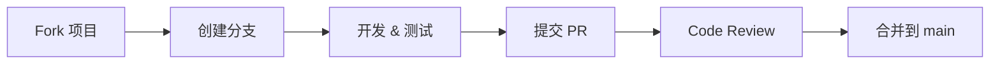

# 贡献指南

感谢你对本项目的兴趣！🎉

无论你是开发者、测试者、文档写手还是普通用户，都有很多方式可以参与贡献。

## 目录

- [行为准则](#行为准则)
- [如何参与](#如何参与)
- [开发流程](#开发流程)
- [代码规范](#代码规范)
- [提交 Issue](#提交-issue)
- [提交 Pull Request](#提交-pull-request)

## 行为准则

本项目采用 [Contributor Covenant](https://www.contributor-covenant.org/) 行为准则。参与即表示你同意遵守其条款。

## 如何参与

### 🐛 报告 Bug

1. 先搜索 [已有 Issue](https://github.com/HelloZER0/HuaweiWmiControl/issues)，避免重复
2. 提 Bug 时请包含：
   - 笔记本型号及系统版本
   - 操作步骤
   - 期望行为与实际行为
   - 截图或错误日志

### ✨ 提交新功能

1. 先开 [Issue](https://github.com/HelloZER0/HuaweiWmiControl/issues/new) 讨论设计方案
2. 确认后再开始编码

### 📖 完善文档

- 修正错别字、翻译错误
- 补充使用教程或常见问题
- 添加新机型的兼容性报告

### 🔬 逆向新固件命令

- 发现新的固件接口后，在 `docs/` 目录下新增说明文档
- 同时在代码中添加对应的命令定义和测试

### 🧪 兼容性测试

在不同型号的华为/荣耀笔记本上测试各项功能，将结果反馈在 [兼容性讨论](https://github.com/HelloZER0/HuaweiWmiControl/discussions) 中。

## 开发流程



## 代码规范

- 遵循项目已有的代码风格（.editorconfig 已配置）
- 提交前运行 `dotnet format` 格式化代码
- 保持三层架构的职责分离：UI 层不直接调用 WMI，抽象层不引用 WinUI
- 新增 WMI 命令时需同步添加单元测试

## 提交 Issue

请使用对应的 Issue 模板：

- [报告 Bug](https://github.com/HelloZER0/HuaweiWmiControl/issues/new?template=bug_report.yml)
- [请求新功能](https://github.com/HelloZER0/HuaweiWmiControl/issues/new?template=feature_request.yml)

## 提交 Pull Request

1. 确保你的 Fork 是基于最新的 `main` 分支
2. 创建功能分支：`git checkout -b feat/your-feature-name`
3. 提交你的改动
4. 确保所有测试通过：

   ```sh
   dotnet test
   ```

5. 发起 PR，描述清楚改动内容和测试情况
6. 等待 Code Review

---

再次感谢你的贡献！🙌
