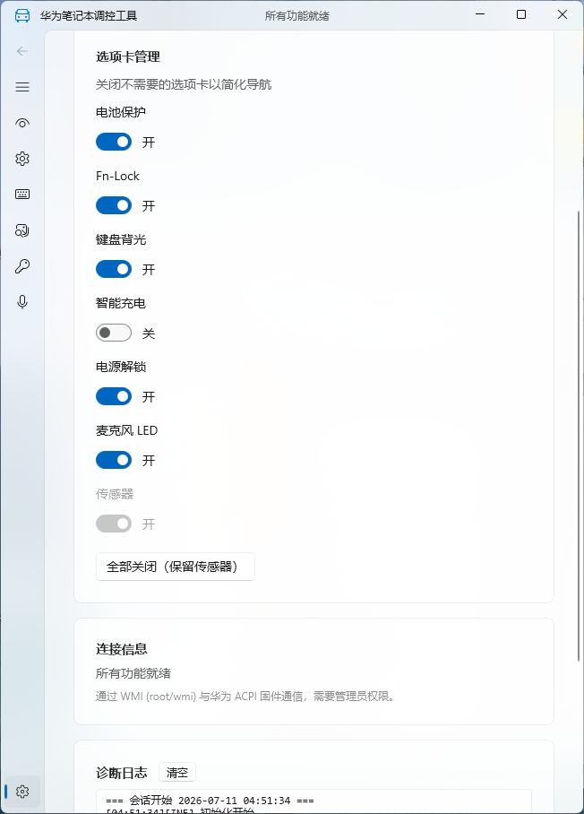

# 华为/荣耀笔记本调控工具

[](https://dotnet.microsoft.com)
[](https://learn.microsoft.com/windows/apps/winui)
[](https://creativecommons.org/licenses/by-sa/4.0/)
[](https://github.com/HelloZER0/HuaweiWmiControl/pulls)
[](https://github.com/HelloZER0/HuaweiWmiControl/actions)

> 告别电脑管家，轻量调控你的华为/荣耀笔记本硬件。



---

## 目录

- [背景](#背景)
- [功能](#功能)
- [设备兼容性](#设备兼容性)
- [安装](#安装)
    - [前置条件](#前置条件)
    - [下载与运行](#下载与运行)
    - [自行编译](#自行编译)
- [用法](#用法)
- [工作原理](#工作原理)
- [技术栈](#技术栈)
- [工程结构](#工程结构)
- [相关项目](#相关项目)
- [主要项目负责人](#主要项目负责人)
- [参与贡献方式](#参与贡献方式)
    - [贡献人员](#贡献人员)
- [开源协议](#开源协议)

## 背景

华为、荣耀笔记本电脑出厂自带的"电脑管家"虽然功能齐全，但后台常驻四五个进程、时不时弹窗、还有从睡眠恢复后 CPU 异常高占用等问题，体验并不好。许多用户只是想用其中的**电池保护（智能充电）**、**键盘背光调节**、**Fn-Lock** 等硬件调控功能，但被迫接受整套臃肿的软件包。

Linux 社区早已通过 [`huawei-wmi`](https://github.com/aymanbagabas/Huawei-WMI) 内核驱动实现了对华为笔记本的硬件控制，但 Windows 上一直缺少一个轻量的替代品。

本项目正是为此而生——基于逆向分析，通过 WMI 直接调用固件接口，实现与电脑管家相同的硬件调控能力，**无需电脑管家后台常驻**。

## 功能

| 选项卡 | 功能 | 备注 |
|--------|------|------|
| 传感器 | CPU/电池/风扇温度、风扇转速 | 只读，首页 |
| 电池保护 | 充电起始/上限阈值 | MACH-WX9 兼容 |
| Fn-Lock | F1-F12 键模式 | 开关 |
| 键盘背光 | 背光亮度（自动刷新）+ 熄灭超时 | 亮度只读 |
| 智能充电 | 华为私有充电模式 | 含附加参数 |
| 电源解锁 | 解除 Fn+P 性能限制 | 开关 |
| 麦克风 LED | 静音指示灯 | 开关 |

> 更多功能持续开发中，欢迎参与贡献。

## 设备兼容性

下表记录了各机型的功能验证情况。如果你在自己的设备上测试过，欢迎在 [✅ 兼容性报告](https://github.com/HelloZER0/HuaweiWmiControl/discussions/categories/compatibility) 分类下提交测试结果，我会定期更新此表。

| 机型 | 系统 | 传感器 | 电池保护 | Fn-Lock | 键盘背光 | 智能充电 | 电源解锁 | 麦克风 LED | 报告人 |
|------|------|:------:|:--------:|:-------:|:---------:|:--------:|:--------:|:-----------:|--------|
| MateBook X Pro 2024 (MACH-WX9) | Windows 11 | ✅ | ✅¹ | ✅ | ✅² | ✅ | ✅ | ✅ | @HelloZER0 |
| MateBook E GO | Windows 11 | ✅ | ✅ | ✅ | ✅ | ✅ | ✅ | ✅ | @AceDroidX |
| 荣耀 MagicBook (BRN-H76) | Windows 11 | ✅ | ✅ | ✅ | ✅ | ✅ | ✅ | ✅ | @HelloZER0 |

> ¹ 电池保护含 MACH-WX9 兼容路径（关闭前先清零阈值并延时 1 秒）  
> ² 键盘背光编码为位掩码反转模式（bit 0 = 最亮）

### 如何测试

下载运行后，逐项测试各选项卡功能是否正常，然后在 [✅ 兼容性报告](https://github.com/HelloZER0/HuaweiWmiControl/discussions/categories/compatibility) 分类下按以下模板发帖：

```markdown
**机型**：
**系统版本**：
**传感器**：✅ 正常 / ❌ 异常 / ➖ 未测
**电池保护**：✅ / ❌ / ➖
**Fn-Lock**：✅ / ❌ / ➖
**键盘背光**：✅ / ❌ / ➖
**智能充电**：✅ / ❌ / ➖
**电源解锁**：✅ / ❌ / ➖
**麦克风 LED**：✅ / ❌ / ➖
**备注**：
```

## 安装

[](https://github.com/HelloZER0/HuaweiWmiControl/releases)

### 前置条件

- Windows 10 17763+ / Windows 11
- **华为/荣耀笔记本电脑**——需已安装 ACPI-WMI 驱动（由电脑管家安装提供，或手动安装驱动；仅需驱动本身，无需电脑管家后台常驻）
- [Windows App SDK 运行时](https://learn.microsoft.com/windows/apps/windows-app-sdk/downloads)（使用预编译包则无需安装）

### 下载与运行

1. 前往 [Releases](https://github.com/HelloZER0/HuaweiWmiControl/releases) 页面下载最新版本
2. 解压后以 **管理员身份** 运行 `HuaweiWmiControl.exe`
3. 开始使用

### 自行编译

如果你熟悉 .NET 开发，也可自行编译：

```sh
# 编译
dotnet build -c Release

# 自包含发布（无需安装 .NET SDK 即可运行）
dotnet publish -c Release -r win-x64 --self-contained -p:WindowsAppSDKSelfContained=true
```

运行 `bin\Release\HuaweiWmiControl.exe`（管理员权限）。

## 用法

打开工具后，界面顶部为选项卡导航：

- **首页**（传感器）：实时查看 CPU、电池、风扇温度及风扇转速
- **电池保护**：设置充电起始阈值和上限阈值，延长电池寿命
- **Fn-Lock**：切换 F1-F12 功能键模式
- **键盘背光**：调节键盘背光亮度（自动刷新状态）
- **智能充电**：切换华为私有充电模式
- **电源解锁**：开启/关闭 Fn+P 性能限制
- **麦克风 LED**：开关静音指示灯

所有设置即时生效，无需重启。

## 工作原理

Windows 侧与 Linux 驱动共用同一套固件命令，仅传输层不同：

- **WMI 命名空间**：`ROOT\wmi`
- **WMI 类**：`OemWMIMethod` → 方法 `OemWMIfun`
- **输入**：新版固件 `u64Input`（uint64）；老版 `u8Input`（64 字节 SAFEARRAY）— 自动适配
- **命令编码**：小端 64 位，命令号低 32 位，参数依次填入字节 2/3，移植自 Linux 驱动的 `union hwmi_arg`
- **返回**：`u8Output` 缓冲区，第 0 字节状态码

> 详细的逆向分析过程参见 [reverse-engineering.md](docs/reverse-engineering.md)。

## 技术栈

| 技术 | 用途 |
|------|------|
| WinUI 3 / Windows App SDK 1.7 | 桌面 UI |
| .NET 8 | 运行时 |
| Microsoft.Management.Infrastructure | CIM/WS-Man WMI 协议 |
| Microsoft.Extensions.DependencyInjection | DI 容器 |
| xUnit + Moq | 单元测试 |

## 工程结构

```
HuaweiWmiControl/
├── HuaweiWmiControl.csproj              # WinUI 3 主项目（UI 层）
├── HuaweiWmiControl.Abstractions.csproj  # 抽象层（纯逻辑，无 WinUI 依赖）
├── HuaweiWmiControl.Tests.csproj         # xUnit 单元测试
├── HuaweiWmiControl/                    # 主项目源码
│   ├── MainWindow.xaml / .cs            # 主界面 + 导航
│   ├── App.xaml / .cs                   # WinUI Application + DI
│   ├── ViewModels/                      # 8 个 ViewModel
│   └── Controls/                        # 自定义控件
├── HuaweiWmiControl.Abstractions/       # 抽象层源码
│   ├── Services/                        # WMI 服务接口 + 实现
│   ├── Wmi/                             # WMI 协议实现
│   └── *.cs                             # 接口/模型/常量
├── HuaweiWmiControl.Tests/              # 测试项目
│   └── WmiServiceBaseTests.cs           # 9 个单元测试
├── docs/
│   └── reverse-engineering.md           # 原始逆向文档
├── README.md
└── .gitignore
```

## 相关项目

- [huawei-wmi](https://github.com/aymanbagabas/Huawei-WMI) — 华为笔记本 Linux 内核驱动，本项目的命令编码基础
- [AceDroidX/HuaweiBatteryControl](https://github.com/AceDroidX/HuaweiBatteryControl) — 基于 C++ 的华为电池控制工具，本项目的逆向分析起点

## 主要项目负责人

[@HelloZER0](https://github.com/HelloZER0)

## 参与贡献方式

[](https://github.com/HelloZER0/HuaweiWmiControl/pulls)

欢迎各种形式的贡献，包括但不限于：

- 🐛 **报告 Bug** — 提 [Issue](https://github.com/HelloZER0/HuaweiWmiControl/issues/new?template=bug_report.yml)，注明你的笔记本型号和系统版本
- ✨ **提交新功能** — 先开 Issue 讨论再 PR
- 📖 **完善文档** — 中文/英文翻译、使用教程、新机兼容性报告
- 🔬 **逆向新命令** — 发现新的固件接口，补充到 `docs/` 目录
- 🧪 **测试与兼容性** — 在不同机型上验证功能，填写兼容性报告

请确保提交 PR 前已通过测试：

```sh
dotnet test HuaweiWmiControl.Tests
```

详细参与指南请参见 [CONTRIBUTING.md](CONTRIBUTING.md)。

### 贡献人员

感谢所有为该项目做出贡献的人。

## 开源协议

[CC BY-SA 4.0](LICENSE) © HelloZER0

---

> **免责声明**：本工具为社区逆向成果，命令编码参照 Linux 主线驱动。不同机型固件可能存在差异，请在实际设备上验证各项功能；使用风险自负。
